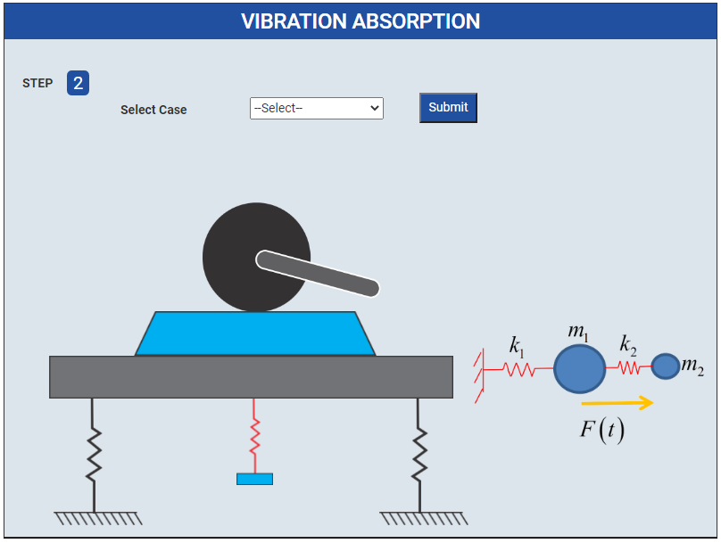
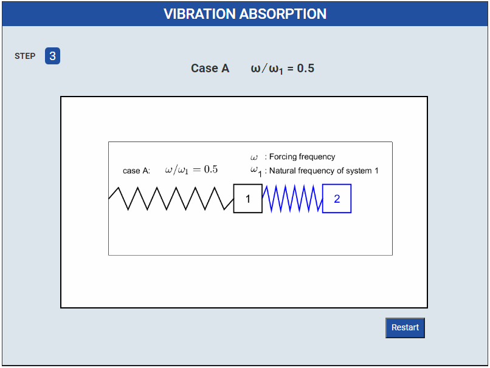

### Procedure

1. Click on Start Here button to start the experiment.
 

2. Select Case
 

3. Click on Submit Button
 

4. Graphs

<!-- 4. Please Fill all values these are given and Click on Calculate Button
 

5. Show the Graphs
 
 -->

