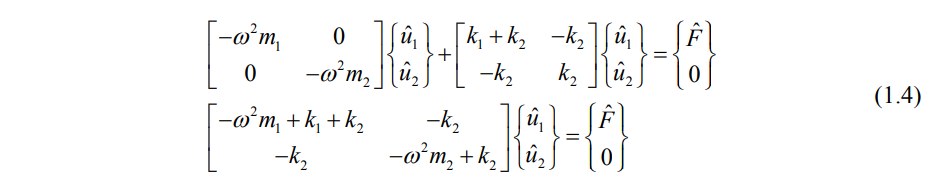

### EXPERIMENTAL METHODOLOGY

<strong>Vibration Absorber

 1.1 Vibration absorber undamped

</strong>

Vibration absorber is a 2DOF system, intelligently designed to absorb the energy of main system
to a secondary system. It has some major application in reducing the vibration response at
machine foundation. To reduce the vibration of foundation some tuned system is generally
attached to the machine to absorb most of the energy.

The equation of motion of the undamped MDOF system is

Now in order to solve the eq-(1.1) assume

So, after taking the differentiation with respect to time eq-(1.2) yields

So, Eq-(1.1) can be rewritten as

Last row of eq-(1.5) gives

Where

First row of eq-(1.5)

So, kinetic energy in mass-1

So, kinetic energy in mass-2

So, energy distribution ratio
RD

The energy distribution for mass-1 and mass-2 is shown in Figure 1and Figure 2 respectively.

According to the Figure 1 if the forcing frequency matched with the frequency of the inner system then the main system will not feel any energy. In other word it can be stated that system1 will be insulated or isolated from the force field. Actually the energy is attracted by the system2 for this frequency band as shown in Figure 2.

According to the Figure 1 insulated frequency band is proportional with the mass ratio. If the
mass of the insulator (system-2) is high then it can attract more energy to it.

<strong>

1.2 Vibration absorber damped

</strong>

Vibration absorber is a 2DOF system, intelligently designed to absorb the energy of main system
to a secondary system. It has some major application in reducing the vibration response at
machine foundation. To reduce the vibration of foundation some tuned system is generally
attached to the machine to absorb most of the energy. 

The equation of motion of the damped MDOF system is

Now in order to solve the eq- <strong>Error! Reference source not found.</strong> assume

So, after taking the differentiation with respect to time eq- <strong>Error! Reference source not found.</strong>
yields

So, Eq- <strong>Error! Reference source not found.</strong> can be rewritten as

Last row of eq- <strong>Error! Reference source not found.</strong> gives

where 

First row of eq- <strong>Error! Reference source not found.</strong>

So, the dynamic amplification factor 

So, kinetic energy in mass-1

So, kinetic energy in mass-2

Because,

So, energy distribution ratio RD

<strong>Example</strong>  Determine the frequency, modal mass, modal participation factor and effective mass of first 2
mode of the following system.

The frequency of the system is det ( K - &#969;2M) = 0

Assume the frequency of each spring mass system is and ratio of two springs is 

So, 

 <!-- Fig(1.7): Response of 30th mass 
 From all these plots we can clearly see that once the value of &#951; becomes greater than 2 attenuation in response of all these mass is observed.
 We can also observe that attenuation increases as value of &#951; increase. Also the distant masses observe more attenuation as compared to mass which is closer to the node where external harmonic force is applied.
 -->
<!-- 

From Eqs. (1.5) and (1.6), we obtain

Similarly, Eqs. (1.6) and (1.4) give

Since the deflection of the plate w is a function of r and &#952;, the chain rule of differentiation yields

For the expressions &#8706;2w &#8725; &#8706;x2, &#8706;2
w &#8725; &#8706;x&#8706;y , and &#8706;
2w &#8725; &#8706;y2, the operations &#8706;/&#8706;x and &#8706;/&#8706;y of
Eqs. (1.9) and (1.10) are repeated to obtain

By adding Eqs. (1.11) and (1.12), we obtain

By repeating the operation &#8711;2
twice, we can express

Using Eqs. (1.9), (1.10), and (1.11) in the equation of motion for the forced transverse vibration
of a circular plate can be expressed as

1.3 Moment and Force Resultants
Using the transformation procedure, the moment resultant - transverse displacement relations can
be obtained as:

Similarly, the shear force resultants can be expressed as

The effective transverse shear forces can be written as

Note that the Laplacian operator appearing in Eqs. (1.20) - (1.23) is given in polar coordinates by
Eq. (1.14).
1.4 Boundary Conditions
1. Clamped, fixed, or built-in edge. The deflection and slope (normal to the boundary) must be
zero:

where r denotes the radial (normal) direction to the boundary.

2. Simply supported edge. The deflection and bending moment resultant must be zero:

3. Free edge. The bending moment resultant and the effective shear force resultant on the edge must be zero:

4. Edge supported on elastic springs. If the edge is supported on linear and torsional springs all
around as shown in Fig. 1.3, the boundary conditions can be stated as follows:

 -->

<!-- 
 
 
 

where &#8733;(x,t) represents the angle between the tangent to the string at x and the x-axis, as shown in Figure 2. Dividing both sides of (1.1) by &#8710;x and taking the limit &#8710;x &#8594;0 yields

 

where [.],x represents partial derivative with respect to x. From geometry, one can write

 

Substituting (1.3) in (1.2), and assuming w,x &#8810; 1, yields on simplification

 

Therefore, when n(x,t) &#8801; 0, equation (1.4) implies that the tension T (x,t) is a constant. On the other hand, for a hanging string, shown in Figure 3, one has n(x,t) = &#961;A(x)g, where &#961; is the density, A is the area of cross-section, and g is the acceleration due to gravity. Then, using the boundary condition of zero tension at the free end, i.e., T (l,t) &#8801; 0 (for constant &#961;A), (1.4) yields T (x,t) = &#961;Ag (l - x). in general, the tension in a string may also depend on time. However, in the following discussions, it will be assumed to depend at most on x.

 

Figure 3. Schematic representation of a hanging string.
Now, consider the transverse dynamics of the string element shown in Figure 1. The equation of motion of the small element in the transverse direction can be written from Newton’s second law of motion as

 

where &#8710;m is the mass of the element, &#952; &#8712;[0,1], and (.),tt indicates double partial differentiation with respect to time. Again assuming  w,x.&#8810;1 one can write sin&#8733;  &#8776; tan&#8733; =  w,x. Further, &#8710;m = &#961;A(x)&#8710;s. Using these expressions in (1.5) and dividing by &#8710;x on both sides, one can write after taking the limit &#8710;x &#8594; 0

 

where, based on the previous considerations, we have assumed ds/dx  &#8776; 1. The linear partial differential equation (1.6), along with (1.4), represents the dynamics of a taut string. When the external force is not distributed but a concentrated force acting at, say x = a, the forcing function on the right hand side of (1.6) can be written using the Dirac delta function as

 

where f(t)is the time-varying force, and  &#948;(.) represents the Dirac delta function.
An important particular form of (1.6) is obtained for p(x,t)  &#8801; 0, and T and &#961;A not depending on x. We can rewrite (1.6) as

 

where  c=&#8730;(T/&#961;A)  is a constant having the dimension of speed. This represents the unforced transverse dynamics of a uniformly tensioned string.  The hyperbolic partial differential equation (1.8) is known as the linear one-dimensional wave equation, and c is known as the wave speed. This implies that a disturbance created at any point on the string propagates with a speed c. It should be clear that the wave speed c is distinct from the transverse material velocity (i.e., the velocity of the particles of the string) which is given by w,t (x,t)  
The complete solution of the second-order partial differential equation (1.6) (or (1.8)) requires specification of two boundary conditions, and two initial conditions. For example, for a taut string shown in Figure 1, the appropriate boundary conditions are w (0,t)  &#8801; 0 and w (l,t)  &#8801; 0.  For the case of a hanging string, the boundary conditions are w (0,t)  &#8801; 0 and w (l,t) is finite.  The initial conditions are usually specified in terms of the initial shape of the string, and initial velocity of the string, i.e., in the forms w(x,0) = w0 (x),and w,t(x,0) = v0 (x), respectively. 

<a href="images/infinitecomplete.pdf" target="_blank">Infinite Complete</a>

<a href="images/infinitereverse.pdf" target="_blank">Infinite Reverse</a> -->
